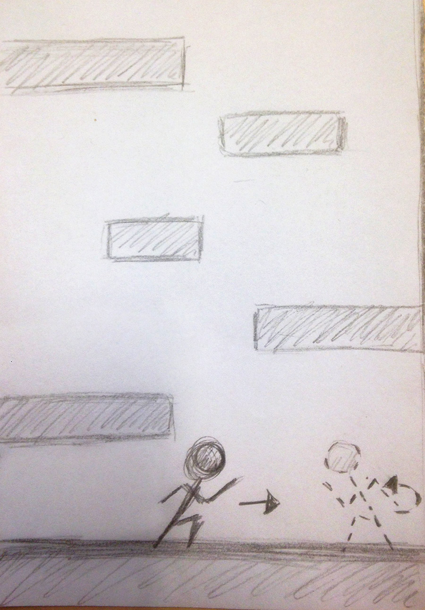
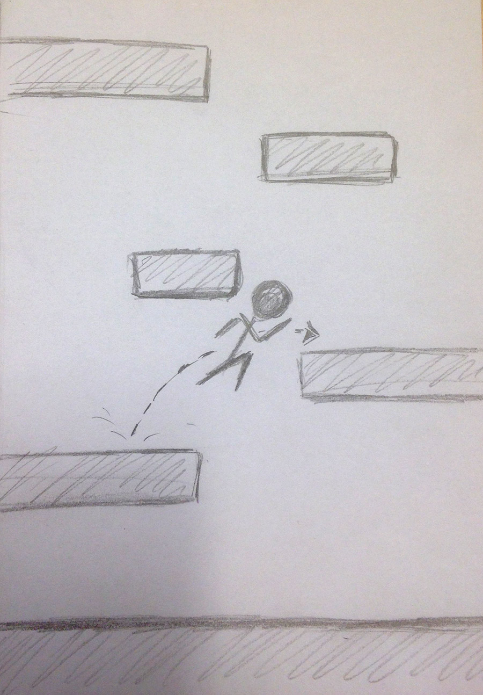
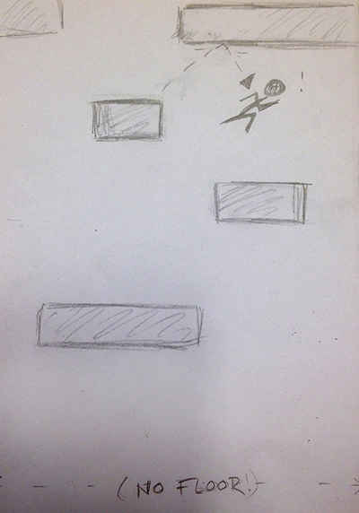
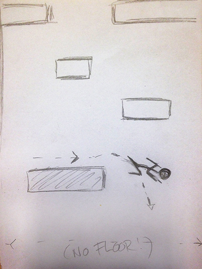

# Design doc for Jump or Drop

Anna Dechering
10288384

a basic game based to exercise timing and hand-eye coordination while tackling boredom. 
The player times the jumps of an avatar climbing a 2D tower with missing platforms. Should the player fall from the screen, the game ends. The higher the player might climb, the higher the score. 

Minimal Viable Product
----------------------
Gameplay: 

- player avatar able to move and jump 
- platforms generating offscreen and moving onscreen
- game ends at the moment the avatar moves offscreen

Additional Features
--------------------
- highscores 
- animation of player avatar
- special platforms 

Design
------

 "Player moving on ground floor"

The game is played in portrait mode.
The avatar starts out moving at a constant speed from left to right. 
When the avatar reaches the end of the screen, he automatically turns direction-> moving from right to left.

 "Player jumps to climb platform"

As the player touches the screen, the avatar jumps. This way the player can 'climb' the platforms. His goal is to reach the highest platform possible and not fall from the screen.

 "Player bounces from block "

The avatar bounces back from both the borders of the screen, as well as the platforms above him (when timed poorly...). 
As the player progresses in the game, the screen will 'move' over the levels vertically.
Soon the ground floor will dissapear, leaving a gap in which the player might fall.

 "Player falls - game ends"

Should the player fall and there is no lower platform the player could land on (in other words: the player falls and disappears from the edge of the screen), the game ends. 

Classes
-------

GameScene:

 a view that contains the game loop. It checks the game state and updates all sprites that are used (ie player, platform). Not completely sure if the actions of the sprites will be defined in here or are moved to their own class. 
actions:

+ isStarted(BOOL)
+ isOVer(BOOL)
+ start()
+ touchesBegan()
+ touchesEnded()
+ update()

Player:

 a SpriteNode class that contains properties of players avatar.
 if there is any time left, a simple animation might be implemented here.
 actions to flip the avatar when it reaches the boundaries of the screen horizontally will be implemented here as well. 
 actions:
 
 + isIdle(BOOL)
 + isGrounded(BOOL)
 + jump()
 + move()
 + update()

MovingLevel:

 a SpriteNode class that renders the background and the actions to let it move when the player advances through the game. This will be invoked by a sequence of moving the sprite of the level down and then resetting its position.
actions:

+ isMoving(BOOL)
+ shouldProgress(BOOL)
+ move()
+ update()

Platform:

a spriteNode class? with a dictionary of different sized platforms.
at the moment the player progresses (jumps to the another platform) it should read a random value and choose a kind of platfom according to the number
 otherwise a dictionary with different sized platforms might suffice. In that case the MovingLevel class will call upon the platform dictionary to provide a sprite to render at the top of the screen

Highscore:

a view that pops up when the game is over, asking for the username and presenting the score of the current player along the highsore list. The highscores are presented by a table with a field for the username and a field for the score. 
actions:

+ enteredName(BOOL)
+ update()

